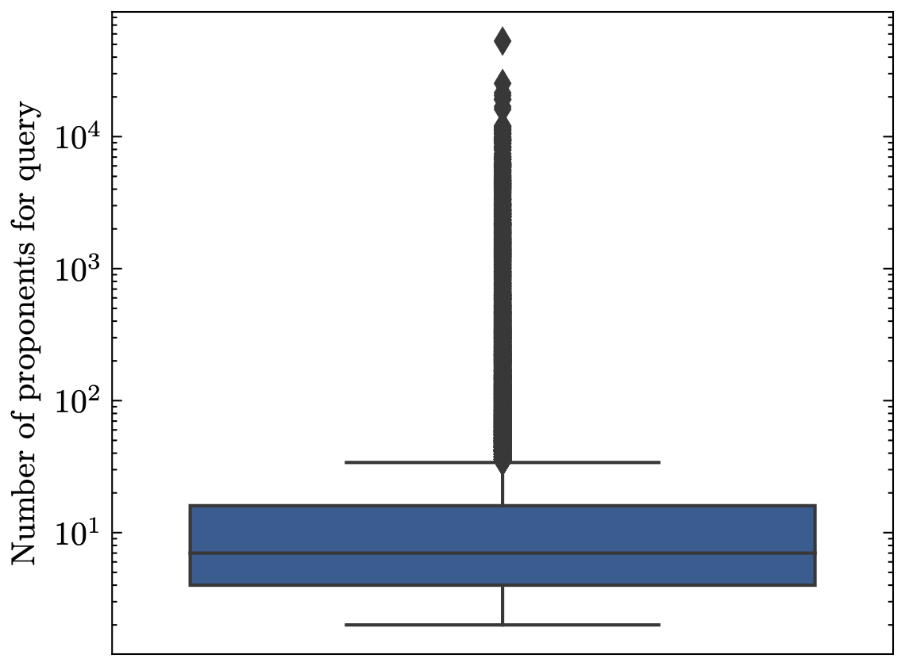
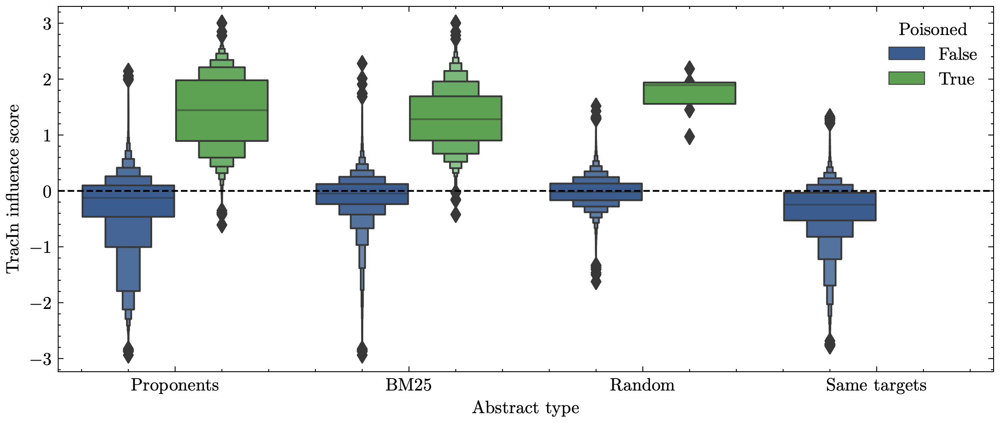

# {{title}}
> This post was written when I was using [Quarto](https://quarto.org/) for the site and is now partly broken. I might revisit it some day and fix some of it but for now it's just a raw transfer.

I recently completed my master's degree in Human-Centered AI from the Technical University of Denmark (DTU) and having handed in on July 16th and defending the thesis orally on August 1st 2023, I thought it might be a good exercise for myself to transfer to oral presentation into a "textual representation", if you will.

It is largely for my own sake but with a slight hope that someone out there will appreciate it at some point! I will try to stick to the outline that I used during the presentation in order to present it in the same way.

Keep in mind that a lot of my work and details has been omitted from the presentation in the interest of time, as I had 30 minutes to present my 6 month endeavour. If this post sparks your curiosity, you can find the full report [here](https://www.overleaf.com/read/vdyqtjdyvxmk) where it will hopefully be described in more detail.

Anyway, hope you enjoy!

## Motivation

### What is meant by *factual certainty?*

In an episode of a Danish TV show called "Kunstig Intelligens: Hvad er fake?" or translated "Artificial Intelligence: What is fake?" we see the host, Tobias Hansen, asks ChatGPT to write an article about Tobias' greatest achievements in 300 words. ChatGPT then goes on to talk about how Tobias has been the host of *Aftenshowet,* has won awards, etc. which is simply not true.

This behaviour is commonly referred to as *hallucinations*, where the language model produces text that seems to be coherent but is not grounded in reality. This is a problem that is becoming increasingly relevant as we see more and more applications of language models potentially affecting people's lives.

The reasons as to why these models hallucinate are many, but one is that they are lacking a sense of factual certainty. We see that datasets are becoming increasingly larger and reaching unfathomable sizes. Since the model's view of the world is restricted to the training data we must assume that some amount of misinformation is taught to the model, resulting in conflicting information.

*The question that we would like to deal with here is that of whether we can measure which data points are important for such hallucinations.*

As for now, ChatGPT and other chat-oriented applications of language models might make it seem like the impact of hallucinations can be neglected by the human user applying a bit of their common sense, however as these systems become increasingly integrated in more complex systems we might not be able to be as critical to the raw output of these models.

## Background

### Deep Learning & Language Modelling

As for background, I will assume that you are fairly familiar with the concept of deep learning and language modelling in order to keep this brief.

What a language model does is essentially to learn the probability distribution of text sequences. It can express whether sentence A is more likely than sentence B. This idea can then be expanded and used for a number of different applications.

With neural language models we learn the statistical structure of language in neural networks which is a collection of parameters that are tuned through optimizing a loss function on text data.

These types of language models are special in that they can infer semantic relationships such as "cat" being closer in meaning to "dog" than it is to "car". In more recent years, we have seen projects such as BERT where the model learns contextual representations via Masked Language Modelling (MLM).

### T5 pre-trained language model

For this project specifically I used the T5 model from Google, which is an encoder-decoder transformer (like the one from Attention Is All you Need) where their novel idea is to reformulate every task into a text-to-text task.

T5 is pre-trained on the C4 dataset which contains 750GB of filtered text, attempting to ensure a higher quality than previous large text datasets. The model employs a masked language modelling strategy they call span corruption where the input is randomly corrupted and the model learns to reconstruct the missing parts.

It can then further be fine-tuned for a number of tasks such as sentiment analysis, question answering, named-entity recognition, etc.

## Training Data Attribution

Now, our original problem was that the training data might contain misinformation which would produce hallucinations. Given that we know that a model produces a hallucination $y_\text{test}$ from input $x_\text{test}$ we could imagine that we wanted to test how important a training sample $z=(x,y)$ is for $z_\text{test}$.

Let's start off by training a model and find the optimal parameters though:

$$
\hat \theta = \arg \min_{\theta \in \Theta} \frac 1 n \sum_{i=1}^N \mathcal{L}(z_i, \theta)
$$

A possible way to measure how impactful $z$ is on $z_\text{test}$ is to simply remove $z$ and re-train the model, measuring the difference the loss on $z_\text{test}$ between the two models:

$$
\hat \theta_{-z} = \arg \min_{\theta \in \Theta} \frac 1 {n-1} \sum_{z_i\neq z} \mathcal{L}(z_i, \theta)
$$

$$
\mathcal{I}(z, z_\text{test}) = \mathcal{L}(z_\text{test}, \hat \theta) - \mathcal{L}(z_\text{test}, \hat \theta _{-z})
$$

However, it is incredibly expensive to re-train the model for every $z$. The question is then if it is possible to approximate $\hat \theta _{-z}$.

#### Influence functions

Koh & Liang (2017) introduces the idea of using influence functions, which is a concept that was introduced in the 80s with the field of "robust statistics". This tool provides a way to approximate $\hat \theta_{-z}$ by placing a small $\epsilon$ in front of the loss-term for $z$ which allows us to observe how the loss evaluated on $z_{\text{test}}$ changes when $z$ is removed by setting $\epsilon = - \frac{1}{n}$:

$$
\hat \theta_{\epsilon, z} = \arg \min_{\theta \in \Theta} \frac{1}{n} \sum_{i=1}^n \mathcal{L}(z_i, \theta) + \epsilon \mathcal{L}(z, \theta)
$$

$$
\mathcal{I}_{\text{up}, \text{loss}}(z, z_\text{test}) = - \nabla_\theta \mathcal{L}(z_\text{test}, \hat \theta)^\top \mathbf{H}_{\hat \theta}^{-1} \nabla_\theta \mathcal{L}(z, \hat \theta).
$$

There are, however, a few problems here. We notice the hessian in the middle of the two gradients, one for the test time sample and one for the training sample. For most modern models with millions, if not billions, of parameters it is largely intractable to compute this term. Another considerable problem is that this idea of influence functions was originally introduced to simpler methods where we are guaranteed an optimal solution. This is not the case with neural networks and therefore the method has shown a tendency to fall apart and produce unstable results.

#### TracIn (Pruthi et al., 2020)

Another team took this idea some years later and thought that they might offer a slightly different interpretation:

$$
\mathcal{I}(z, z_{\text{test}}) = \sum_{k=1}^K \nabla_\theta \mathcal{L} \left(z_{\text{test}}, \theta^{(k)}\right)^\top \nabla_{\theta} \mathcal{L} \left(z, \theta^{(k)}\right).
$$

Looking at both of the equations we see a similarity in that they are both using gradients to compute some sort of metric between the test and training sample. TracIn has seemingly removed the hessian component of the influence function. This leads to a simple dot-product between gradients, which can be interpreted as a similarity measure between the two gradients. In other words, we are interested in finding the training examples which affects the model as similarly as the test sample would have, had it been in the training set itself.

The superscript, $(k)$, indicates the $k$th checkpoint. This is done in an attempt to capture the training dynamics of the network. For example, a training sample might be more influential earlier in during training due to the model not having seen samples that provide the same information.

One thing we might be worried about with the TracIn equation above is that samples would get large influence scores simply due to having large gradients. We can remind ourselves that samples with large gradients are often samples that appear to be out of the distribution of their label, such as outliers or otherwise poor samples. What we can do is normalize the expression, resulting in a summed cosine similarity score:

$$
\mathcal{I}(z, z_{\text{test}}) = \sum_{k=1}^K \frac{\nabla_\theta \mathcal{L} \left(z_{\text{test}}, \theta^{(k)}\right)^\top \nabla_{\theta} \mathcal{L} \left(z, \theta^{(k)}\right)}{||\nabla_\theta \mathcal{L} \left(z_{\text{test}}, \theta^{(k)}\right)||~||\nabla_{\theta} \mathcal{L} \left(z, \theta^{(k)}\right)||}
$$

This is now an expression that attributes a larger score when a test and training sample simply affects the model's parameters in the same direction, as the magnitudes of the gradients are disregarded by normalization.

I tried to do a simple example on MNIST to get a visual feel for how the two equations would attribute influence scores and to which training samples:

**Comparison of TracIn variants:**

From these examples it is clear that the dot-product variant of TracIn attributes a high score to training samples that are outliers in some sense while the cosine similarity variant finds training samples that we can imagine conveys the same information as the test sample would have, had it been in the training set.

#### How can TDA be used in terms of factual certainty?

At this point you might be scratching your head a little bit to see how these methods can be plugged in, in an NLP context to help with making language models more factually certain. For this purpose we might imagine that there is a labelled relationship between training samples that express a certain fact and a test sample that makes the model recite that fact. This is exactly what the FTRACE-TREx (Akyürek, 2022) provides.

#### FTRACE-TREx

Below are some examples from FTRACE-TREx of training and test data where the training data is labelled as **ground-truth proponents** for the corresponding test sample. Ground-truth proponents are samples that should teach the model about the fact that is expressed in the test sample, in other words they should lower the loss of the test sample.

| Training sample | Test sample |
| --------------------------------------------------------------------------------------------------------------------------------------------------------------------------------------------------- | ------------------------------------------------------------------------------------- |
| **Input:** “Situated in the heart of [MASK], Denmark, it is located on Kongens Nytorv opposite  Charlottenborg, the Royal Opera and Nyhavn.”   **Target:** “Copenhagen” | **Input:** “Charlottenborg Palace is located in [MASK]”   **Target:** “Copenhagen” |
| **Input:** “He later became a news anchor in Dagsrevyen, the main newscast of the Norwegian Broadcasting Corporation, at that time the only television channel in [MASK]”   **Target:** “Norway” | **Input:** “Dagsrevyen was created in [MASK]”   **Target:** “Norway” |
| **Input:** “Melnik Peak (Vrah Melnik ’vr&h ’mel-nik) is the 696 m summit of Melnik Ridge in eastern [MASK], South Shetland Islands in Antarctica.”   **Target:** “Livingston Island” | **Input:** “Melnik Ridge is located in [MASK]”   **Target:** “Antarctica” |
There are roughly 1.5m training examples which are referred to as *abstracts*. They can be thought of as small paragraphs from Wikipedia where the masking for MLM is controlled in such a way that either an object or a subject of a fact is masked out.

The test set consists of 31.5k facts referred to as *queries* as we can think of the test-time predictions as a way of testing whether the model has retained facts from the training data. These are systematically built from fact-triplets (subject, relation, object) - e.g. (”Charlottenborg Palace”, “is located in”, “Copenhagen”) - where there are a total of 41 relation predicates that are used throughout the test set. Each query has an average of 83 proponents in the training data.

For computational reasons, since doing back-prop for each of the 1.5m abstracts for each query is expensive, we construct a ***candidate set*** for a given query which consists of

- Top 100 abstracts retrievals from BM25,

- 100 abstracts which shares their target with the query,

- 100 random abstracts to act as distractions,

- and finally all proponents for the query.

This set should consist of all relevant abstracts for a query as well as some distractors to set a baseline of the influence scores to come.

## Results from experiments

For the first part, I simply followed the process laid out by existing research, in particular (Akyürek, 2022), which consisted of the following,

1. Train a model on FTRACE-TREx and save checkpoints throughout training

2. Define “Novel Facts”, which are queries that are incorrectly predicted before training on FTRACE-TREx but correct after, and randomly select a 1000 of those for analysis

3. Compute influence scores for each checkpoint on the randomly selected novel facts.

### TracIn influence scores

This process resulted in the plots seen here,

Mean TracIn influence score for each of the abstract types in the candidate set as well as grouped by checkpoints.

Summed TracIn influence for each of the abstract types in the candidate set.

We can immediately see that the `Random` abstracts gets a very low influence score which is to be expected. What is not obvious however is that the `Proponents` are on average attributed a relatively low influence score. The `Same targets` is seemingly attributed a consistent high influence score.

### Target sensitivity

One thing that is striking about these results is that there is apparently a fair amount of proponents which gets scored so negatively that they would be categorised as *opponents* rather than proponents, i.e. the score suggests that the training example increases the loss of the test sample. This did not make a lot of sense to me, so I went ahead and looked at which training examples get such negative scores and compared them to their corresponding query.

A pattern emerged from this as I found that slight variations in the target would essentially flip the score completely. For example, the query “Amsterdam is the capital of [Netherlands]”, where “Netherlands” is masked out, has the abstract “Gone Bald is a noise rock band from Amsterdam, [The Netherlands]” as its proponent, yet is attributed an influence score of -1.94. If we change either target to match the other’s the score is flipped to a high score of 1.96. Other examples of this behaviour includes “Apple”/”Apple Computer”, “Amazon”/”Amazon.com”, “London”/”London, England”, “Mumbai”/”Greater Mumbai”, etc.

This had me wondering: How far does this go? What other seemingly inconsequential changes can I make for the gradients to be vastly different? So taking a sentence “Copenhagen is the capital of [Denmark]” and “Copenhagen is the capital of [Denmark.]” - i.e. just adding a single “.” to the target, resulted in a cosine similarity of 0.32 whereas without the “.” they would of course be perfectly similar and get a score of 1.

All of this suggests that the gradients that are produced by the T5 model is highly sensitive to the target value, which also explains the high scores in the `Same target` abstract type.

### FTRACE-TREx inspection

I wanted to dig further into FTRACE-TREx since I had noticed some potential issues while working with the dataset.

In the paper that introduces the dataset it is mentioned that the average size of the proponent sets for the queries is 83. While this is true it is also somewhat misleading as the median of the proponents set is 7, indicating that there are large outliers pushing that mean value. We observe that some queries have associated proponent sets in the tens of thousands while others have much fewer. This obviously affects the training process as some test samples have far more training data. This also hurts accessibility and reproducibility as processing one of those queries' proponent sets is expensive and time-consuming, compared to having not randomly sampled them.

Another notable aspect of the test set is that each query is glued together with a predicate, such as “[X] is the capital of [Y]”. What we see here is that some predicates has a much larger average number of associated proponents, simply increasing the training data for a given type of predicate. Related research (Park et al., 2023) has suggested that something like this could lead to the model learning behaviour rather than the facts themselves, such as learning relationships of capital cities not because it was presented with the facts, but because of the country-capital relationships.

### Robustness of leave-one-out error

Throughout the project I had read through research that is related to Koh and Liangs influence functions paper as well as TracIn. One particular finding from (Søgaard et al., 2021) was that the metric that we are trying to estimate - the leave-one-out error - is not itself a robust metric. Due to a number of stochastic factors involved with training deep neural networks it can not be expected that removing a single training point affects the network the same way every time. So essentially, these methods have been chasing after something that itself is not robust.

This then begs the question, which (Bae et al., 2022) has as the title for their paper, **“If Influence Functions are the Answer, Then What is the Question?”.**

One suggestion by Søgaard et al. is that we can evaluate TDA methods not in their ability to estimate LOO error, but rather finding poisoned training data. In the context of this project we might imagine that we can inject misinformation by systematically changing the targets of certain training samples in order to poison the training set.

### Misinformation surfacing

This brings us back to the original conundrum: Since a contributing factor to language model hallucinations is conflicting facts in the training data, can we find misinformation in order to remove it, thus making the model more factually certain?

To evaluate this, I constructed a pipeline that would systematically poison the training data with alternate yet semantically valid targets which is illustrated below,

Running TracIn on the poisoned training data results in the scores seen below. We notice that the distributions between the poisoned and un-poisoned are remarkably different, allowing for distinguishing between misinformation and actual facts.

## Conclusion

To circle back to the TV show that was shown in the beginning of the post, they later took a question from a viewer who asked “If AI gets its information from the internet, is it possible for it to distinguish fake news, conspiracy theories and truth? - Poul”

To which I will now answer: Well, kind of…

We can use these TDA methods to find training data that affects the model similarly as a given test example would have, had it been in the training data. There are, however, some immediate limitations that should be addressed.

The computational challenge of using gradient similarity as a way to measure TDA can not be ignored. It is very expensive, and oftentimes completely infeasible, to compute the gradient for each of the training examples. There could be some heuristics to create a candidate set similarly as we had done in this project, but I would suspect that there is not “one size fits all” solution for that as it would depend on the problem at hand.

Furthermore, we saw that TracIn, and its reliance on gradient similarity, seemingly lacked robustness in some sense. Minor changes to the samples would cause the gradients to become very dissimilar. Research in explainability suggests that the non-smoothness of some of the used non-linearities in the network's activation functions might not be suitable when it comes to comparing gradients in this fashion (Dombrowski et al., 2019). This would be an obvious next step to test in future iterations of the project.

Overall, I am fairly happy about my thesis as a whole. I can sum up my contributions to the area as being:

- Suggest an increase in focus on robustness of TDA methods

- Show that existing TDA benchmarking datasets exhibit issues related to accessibility and reproducibility

- Explore potential for practical use-cases for handling misinformation in datasets by providing a pipeline for poisoning training data
